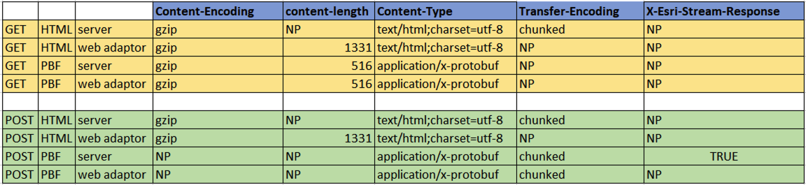

# knowledge-pbf

The majority of knowledge graph server REST end points use protocol buffers as a mechanism for serializing structured data during request and response phases of the REST end point. 

## Features
* protobuf definitions to work with Knowledge Graph Service REST endpoints
* scripts to build proto files into language specific helper classes

## Instructions

1. Clone the repo. 
2. Build or download google's protoc.exe compiler. [Instructions here](bin/README.md)
3. Build proto files using the [build](build.ps1) script.

## Requirements

* Google's protoc.exe compiler
* Powershell or [Powershell Core](https://github.com/PowerShell/PowerShell)

## Issues

Find a bug or want to request a new feature?  Please let us know by submitting an issue.

## Contributing

Esri welcomes contributions from anyone and everyone. Please see our [guidelines for contributing](https://github.com/esri/contributing).

## Licensing
Copyright 2021 Esri

Licensed under the Apache License, Version 2.0 (the "License");
you may not use this file except in compliance with the License.
You may obtain a copy of the License at

   http://www.apache.org/licenses/LICENSE-2.0

Unless required by applicable law or agreed to in writing, software
distributed under the License is distributed on an "AS IS" BASIS,
WITHOUT WARRANTIES OR CONDITIONS OF ANY KIND, either express or implied.
See the License for the specific language governing permissions and
limitations under the License.

A copy of the license is available in the repository's [license.txt](LICENSE.txt) file.

---

## What is Protobuf?

JSON as a conduit to request and recieve response data is a very verbose format. The most expensive component is serializing and deserializing JSON. Protocol buffers, or Protobuf, is a binary format created by Google to serialize data between dfferent services. It is simpler, smaller, faster and more maintainable than JSON or XML. 

Learn more about protocol buffers here:   
https://developers.google.com/protocol-buffers

This repository holds the protobuf definitions of the structured data sent during request and response phases of HTTP messages.  

There is also easy language integration. We will provide a mechanism to generate serialization/deserialization code in different languages including C#/C++/JAVA/JS/Python. More languages can also be added as needed using Google protocol buffer compiler.

## Optimized For Speed

The Knowledge Graph Service (KGS) has designed the REST end points for performance. Protobuf gives us lossless compression. Moreover, we have made specific data type and design choices to minimize the protobuf payload during transfer. 

As a result, there are a number of nuances and contracts that a client must consider when working directly with KGS REST end points. They are outlined below.

---
## Compiling protobuf files

We have provided a powershell script `build.ps1` that will generate the encoding / decoding classes for the following languages:
 - C++
 - C++ DLL Export
 - C#
 - Python
 - Java

This script has only been tested against Windows 10 platform. It requires the existence of a `protoc.exe` compiler in the `bin` directoy of this repository. There are further instructions on how and where to acquire the compiler in the `README.md` of the `bin` directory.

To compile encoding / decoding classes in JavaScript, we have provided a `jsbuild.ps1` script under the `KnowledgeGraph` directory. Please invloke `jsbuild.ps1` from the root directory of the repository. This script will generate a bundled classes in `EsriKnowledgeGraph.js` & `EsriKnowledgeGraph.min.js`

---
## How to execute a query request

The Knowledge Graph Service query REST end point is located under the graph resource:
```url
https://<server_name>/server/rest/services/Hosted/<service_name>/KnowledgeGraphServer/graph/query
```

The query request is defined in the QueryRequest.proto file as follows (as of 10.9.1):
```proto
message GraphQueryRequest {
	string open_cypher_query = 1;

	// 4/7/2020: `parameters` can only contain combinations of:
	//    - primitive values
	//    - array values
	//    - homogeneous arrays
	//    - anonymous objects
	// We'll throw a runtime error if the following are encountered:
	//    - entity values
	//    - relationship values
	map<string, AnyValue> parameters = 2;

	EsriTypes.esriFeatureEncoding feature_encoding = 3;
	EsriTypes.SpatialReference out_sr = 4;
	EsriTypes.DatumTransformation datum_transformation = 5;
	bool apply_vcs_projection = 6;
	QuantizationParameters quantization_parameters = 7;

	// Only applies to geometries sent by the client to the server
	Transform input_transform = 8;
}
```

### GET

GET query requests do not support a binary body. In other words, GET requests only support passing query parameters on the URL. 

A GET query request will not stream the query response back to the client. Moreover, the number of rows returned will abide by the max records defined on the service definition.

### POST

Query POST requests support passing a binary body on the query request itself as well as parameters on the URL.

### PBF Body

The public proto repository contains helper scripts to generate PBF encoding/decoding classes in a variety of languages. We can use these encoding classes to encode a PBF `GraphQueryRequest` object, whose binary representation can be placed in the request body. Be sure to set the `Content-Type` on the request header to `application/octet-stream` to indicate the body is an __unknown binary__ file.

When a POST request with a PBF binary body is sent to the Knowledge Graph Service (KGS), the response will be streamed. 

## How to read the response
The query response can be returned in HTML output or as PBF. We do not support a JSON response by design. 

### Compression
The response may be compressed according to the chart below



### Encoding of query response
The query response contains 1 GraphQueryResultHeader and 0..N GraphQueryResultFrame. Every GraphQueryResultFrame contains 0..N GraphQueryRow.

The tables below describes the encoding of QueryResponse

- Numeric values outside of PBF messages are encoded using PBF's Varint encoding: https://developers.google.com/protocol-buffers/docs/encoding#varints
- K : uint64_t, representing the graph result frame no. (eg: 0..N)

#### When the response is gzip compressed:
Segment no. | Size (bytes) | Type | Content | Value alias
-|-|-|-|-
0 | variable | uint64 (varint encoding) | Size of header message | SzHdr
1 | SzHdr | GraphQueryResultHeader |
(2 * K) + 2 | variable | uint64 (varint encoding) | Size of GraphQueryResultFrame message | SzRec(K)
(2 * K) + 1 + 2 | SzRec(K) | GraphQueryResultFrame | 

#### When the response is not gzip compressed:
When the response if not gzip compressed, the individual GraphQueryResultFrame messages will be gzip compressed.

Segment no. | Size (bytes) | Type | Content | Value alias
-|-|-|-|-
0 | variable | uint64 (varint encoding) | Size of header message | SzHdr
1 | SzHdr | GraphQueryResultHeader |
(2 * K) + 2 | variable | uint64 (varint encoding) | Size of gzip compressed GraphQueryResultFrame message | GzipSzRec(K)
(2 * K) + 1 + 2 | GzipSzRec(K) | gzip compressed GraphQueryResultFrame | 

### Header

From the response, the client must first decode the header. The header is not compressed, and can be decoded using the usual protobuf helper classes. 

For example, in Java it may look as follows:
```java
QueryResponse.GraphQueryResultHeader header = QueryResponse.GraphQueryResultHeader.parseDelimitedFrom(responseStream);
```

Let's inspect the proto header definition:
```proto
message GraphQueryResultHeader {
	uint64 data_model_timestamp = 1; // UTC UNIX epoch in milliseconds
	Transform transform = 2;
	Error error = 3; // optional
	repeated string field_names = 4;
	bool compressed_frames = 5;
}
```

Amongst other information, the query response header will indicate whether the following response frames are compressed. The client will need to consume this boolean and choose whether to decompress the frames prior to decoding them.

### Result Frames

The http response header will indicate the Content-Encoding: gzip and the content-length determines the number of compressed bytes. The return format can either be HTML or PBF. 

After decompressing the response, if PBF, the client will be responsible for decoding the PBF into a usable object in the language of their choice.

### Streaming
If streaming, the http response header will indicate the response is streaming by either setting the `X-Esri-Stream-Response` attribute to 'true' or by setting `Content-Type` attribute to `application/x-protobuf` and `Transfer-Encoding` to `Chunked`. As a client, you can continue to read the result frames until they are null.

#### Empty Result Frames (AKA: Heart Beat)
If streaming, clients should expect to receive empty result frames (GraphQueryResultFrame with 0 rows). Empty result frames are written in response stream to keep the http connection alive while server is busy querying the next row. An empty result frame does not indicate end of streaming instead client must continue to read the stream until they receive a null result frame. 

---
## How to execute an apply edits request
The Knowledge Graph Service `applyEdits` REST end point is located under the graph resource:

```url
https://<server_name>/server/rest/services/Hosted/<service_name>/KnowledgeGraphServer/graph/applyedits
```

### POST
ApplyEdits is a POST only operation and its input parameters must be passed as PBF binary body on the post request. Be sure to set the Content-Type on the request header to `application/octet-stream` to indicate the body is an unknown binary file.

### PBF Body
PBF messages required to construct the input parameters are defined in the [ApplyEditsRequest.proto](proto/esriPBuffer/graph/ApplyEditsRequest.proto) file.

#### Encoding of input parameters as PBF binary
ApplyEdits request's input PBF binary must contain 1 uncompressed `GraphApplyEditsHeader` and 0..N compressed `GraphApplyEditsFrame`. Every `GraphApplyEditsFrame` contains entities and relationships for `adds`, `updates` and `deletes`. 

##### GraphApplyEditsHeader PBF message
```proto
message GraphApplyEditsHeader {
	EsriTypes.SpatialReference spatialReference = 1;

	// Set useGlobalIDs to True if all the named objects referenced in the request are identified by GlobalID.
	// This applies to Updates and Deletes. 
	// If useGlobalIds=True, the server will return an error if the client is attempting to update or delete a named object by ObjectID.
	// Conversely, if useGlobalIds=False, the server will return an error if the client is attempting to update or delete a named object by GlobalID.
	bool useGlobalIDs = 2;

	// Set cascade_delete to True for automatically deleting all relationships connected to an entity before deleting the entity.
	// If cascade_delete=False, the client will have to provide both entities and their connected relationships for deletion, else ApplyEdits operation will fail.
	bool cascade_delete = 3; // default value of cascade_delete is false.

	// Only applies to geometries sent by the client to the server.
	Transform input_transform = 4;
}
```

##### GraphApplyEditsFrame PBF message
```proto
message GraphApplyEditsFrame {
	graph.Adds adds = 1;
	graph.Updates updates = 2;
	graph.Deletes deletes = 3;
}
```

The tables below describes the encoding of ApplyEdits input request

- Numeric values outside of PBF messages are encoded using PBF's Varint encoding: https://developers.google.com/protocol-buffers/docs/encoding#varints
- K : uint64_t, representing the apply edits frame no. (eg: 0..N)

Segment no. | Size (bytes) | Type | Content | Value alias
-|-|-|-|-
0 | variable | uint64 (varint encoding) | Size of header message | SzHdr
1 | SzHdr | GraphApplyEditsHeader |
(2 * K) + 2 | variable | uint64 (varint encoding) | Size of gzip compressed GraphApplyEditsFrame message | GzipSzRec(K)
(2 * K) + 1 + 2 | GzipSzRec(K) | gzip compressed GraphApplyEditsFrame | 

## How to read an apply edits response
The ApplyEdits operation supports only PBF response. We do not support a JSON response by design. The response PBF contains 1 compressed `GraphApplyEditsResult` objects.

GraphApplyEditsResult PBF message
```proto
message GraphApplyEditsResult {
Error error = 1; // to be used in case there was a non-entity/rel-specific reason for the failure

// grouped by named object type name
map<string, EditResults> entity_add_results = 2;
map<string, EditResults> relationship_add_results = 3;

// grouped by named object type name
map<string, EditResults> entity_update_results = 4;
map<string, EditResults> relationship_update_results = 5;

// grouped by named object type name
map<string, EditResults> entity_delete_results = 6;
map<string, EditResults> relationship_delete_results = 7;

// grouped by relationship type name
map<string, CascadingRelationshipDeletes> cascading_relationship_delete_results = 8;

// grouped by relationship type name
map<string, RelationshipTypeSchemaChanges> rel_type_schema_changes = 9;
}
```

PBF messages required to read the response objects are defined in the [ApplyEditsResponse.proto](proto/esriPBuffer/graph/ApplyEditsResponse.proto) file. 
